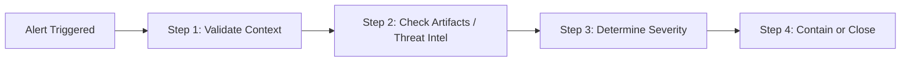

# Module 01: SIEM Fundamentals, Log Sources & Alert Triage

> Security Information and Event Management (SIEM) systems aggregate, normalize, and correlate event data from across an enterprise to detect active threats, unauthorized access, and compliance anomalies.

---

## 📌 1. Critical Windows Event IDs to Monitor

Every SOC analyst must know these core Windows Security Log Event IDs by heart:

| Event ID | Category | Description | Security Relevance |
| :--- | :--- | :--- | :--- |
| **`4624`** | Authentication | Successful User Logon | Track logon types (Type 2=Interactive, Type 3=Network, Type 10=RDP). |
| **`4625`** | Authentication | Failed User Logon | Essential for detecting brute-force or password-spraying attacks. |
| **`4672`** | Privilege | Special Privileges Assigned | Indicates logon with administrator/system-level rights. |
| **`4720`** | Account Mgt | User Account Created | Potential persistence indicator; verify against change tickets. |
| **`4728`** | Group Mgt | Member Added to Security Group | Detects escalation (e.g., user added to Domain Admins). |
| **`4688`** | Process Creation | New Process Executed | Requires Command Line logging enabled; reveals malicious execution scripts. |
| **`1102`** | Audit Log | Audit Log Cleared | High-severity anti-forensic indicator. |

---

## 🔍 2. SOC Alert Triage Workflow

Follow this standardized 4-step triage workflow when evaluating SIEM alerts:



### Step 1: Context Verification
* Is the targeted host critical (e.g., Domain Controller, Database Server, C-Suite Laptop)?
* Is the activity associated with an approved change window or IT maintenance task?

### Step 2: Artifact & Indicator Analysis
* Extract IPs, Domain Names, File Hashes (SHA-256), and User Accounts.
* Query Threat Intel sources (VirusTotal, AlienVault OTX, internal threat databases).
* Check user baseline: Is this user logging in from an unfamiliar country or device?

### Step 3: Classification
* **True Positive (Malicious)**: Confirmed attack; initiate Incident Response (IR) protocol.
* **True Positive (Benign / Policy Violation)**: Unsanctioned tool (e.g., unauthorized torrent client or dev tool); notify user/manager.
* **False Positive**: Alert triggered by normal software behavior; submit tuning request to SIEM engineering.

---

## 🧪 3. Sample Detection Rules (Sigma Standard)

### Rule A: Detecting Multiple Failed Logons Followed by Success (Brute-Force)
```yaml
title: Potential Brute-Force Followed by Successful Logon
status: experimental
description: Detects >10 failed logons (Event 4625) within 5 minutes followed by a successful logon (Event 4624) for the same user.
logsource:
    product: windows
    service: security
detection:
    failed_logons:
        EventID: 4625
    successful_logon:
        EventID: 4624
    timeframe: 5m
    condition: failed_logons count() > 10 by TargetUserName followed by successful_logon
level: high
```

---

## 💡 Best Practices for First-Year Analysts

1. **Focus on Logon Types**:
   * Logon Type `3` = Network share/WinRM.
   * Logon Type `10` = Remote Desktop Protocol (RDP).
2. **Always Check Process Ancestry**: When investigating Event `4688`, check the parent process (e.g., `cmd.exe` spawned by `powershell.exe` or `winword.exe`).
3. **Document Triage Notes Clearly**: Always record: *What triggered*, *What was verified*, *Why closed/escalated*.
