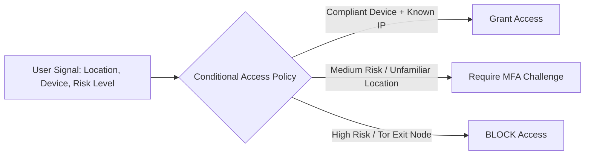

# Module 04: Azure User Access Control & Identity Security (Entra ID)

> Identity is the primary security boundary in cloud computing. Microsoft Entra ID (formerly Azure Active Directory) controls authentication, authorization, and lifecycle management for enterprise cloud resources.

---

## 🔑 1. Role-Based Access Control (RBAC) & Least Privilege

Follow the **Principle of Least Privilege (PoLP)**: Give users only the access required to perform their current duties—no more, no less.

```
       +---------------------------------------------+
       |             Management Group                |
       +---------------------------------------------+
                              |
       +---------------------------------------------+
       |                Subscription                 |
       +---------------------------------------------+
                              |
       +---------------------------------------------+
       |               Resource Group                |
       +---------------------------------------------+
                              |
       +---------------------------------------------+
       |            Resource (e.g. VM/DB)            |
       +---------------------------------------------+
```

### Core Built-in Azure RBAC Roles

| Role | Permissions | Best Practice Usage |
| :--- | :--- | :--- |
| **Owner** | Full access to all resources, including permission to grant access to others. | Restrict to 2–5 emergency break-glass administrative accounts only. |
| **Contributor** | Can create and manage all resource types, but **cannot** grant access to others. | Assign to DevOps leads for specific resource groups. |
| **Reader** | Can view existing Azure resources only. | Default access for auditors, tier-1 monitoring, and junior analysts. |
| **User Access Administrator** | Manages user access to Azure resources without full resource modification rights. | Identity lifecycle team members. |

---

## 🛡️ 2. Entra Conditional Access Policies

Conditional Access acts as an automated decision engine for authentication:



### Essential Baseline Conditional Access Policies

1. **Require MFA for All Administrative Roles**: Mandatory push notification / FIDO2 challenge for Global Admin, Privileged Role Admin, etc.
2. **Block Legacy Authentication**: Block POP3, IMAP, SMTP, and basic auth protocols that bypass MFA.
3. **Require Compliant or Hybrid Joined Devices**: Restrict access to cloud apps to company-managed laptops only.
4. **Location-Based Fencing**: Require extra authentication verification for connections originating outside operational countries.

---

## ⏳ 3. Privileged Identity Management (PIM)

* **Just-In-Time (JIT) Access**: Permanent admin access ("standing access") must be eliminated.
* Users activate privileged roles (e.g., *Global Administrator* or *Contributor*) for a maximum duration (e.g., 2 to 8 hours).
* Requires mandatory justification ticket number and manager approval before role activation.
