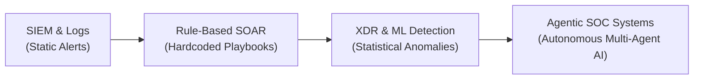
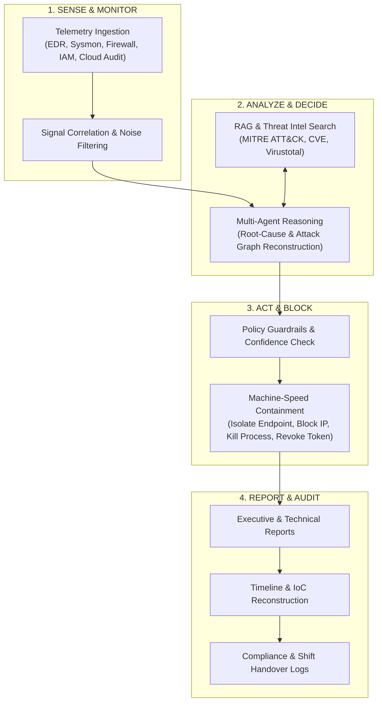
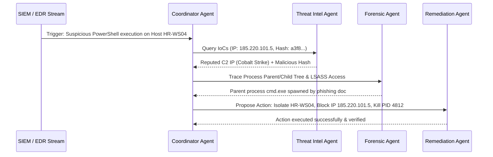

# 🛡️. Cybersecurity Automation & Autonomous AI Agents

> **Focus Areas:** Autonomous Systems, Multi-Agent SOC, Machine-Speed Containment, Threat Intelligence Mapping, and Automated Incident Reporting.

---

## 📌 Executive Summary

Modern cybersecurity defense faces an unprecedented volume of high-velocity threats, alert fatigue in Security Operations Centers (SOCs), and severe analyst burnout. Traditional rule-based automation (e.g., standard static SOAR playbooks) lacks the adaptability required to combat zero-day vulnerabilities, polymorphic malware, and multi-stage targeted attacks.

The cybersecurity paradigm is shifting toward **Agentic AI**—autonomous and semi-autonomous multi-agent systems driven by Large Language Models (LLMs), machine learning anomaly detectors, and API-driven execution engines. 

Research demonstrates that autonomous agents can:
1. **Monitor & Ingest**: Continuously process gigabytes of security telemetry across endpoints, network traffic, identity providers, and cloud logs.
2. **Analyze & Investigate**: Correlate disparate signals, extract Indicators of Compromise (IoCs), and map attack chains to the **MITRE ATT&CK** framework.
3. **Block & Contain**: Automatically execute machine-speed remediation (isolating endpoints, terminating process trees, blocking C2 IPs, revoking compromised access tokens).
4. **Report & Audit**: Autonomously generate complete technical and executive incident reports, post-mortems, and compliance audit logs.

Empirical studies show multi-agent security frameworks can reduce **Mean Time to Respond (MTTR)** by **60% to 78%** while operating 24/7 without manual intervention for routine and mid-complexity incidents.

---

## 🏗️ Evolution of Cybersecurity Automation



| Era | Core Mechanism | Strengths | Limitations |
| :--- | :--- | :--- | :--- |
| **1. SIEM & Alerting** | Log aggregation, regex pattern matching, Windows Event IDs. | Centralized visibility, basic alerting. | High false positives, manual triage required for every alert. |
| **2. SOAR Playbooks** | Static if-then workflows (e.g., Phantom, Demisto/XSOAR). | Speed up routine API actions. | Rigid; fails on unexpected attack variants; requires constant manual updates. |
| **3. XDR & ML** | EDR/NDR telemetry + behavioral machine learning. | Detects unknown anomalies and process injection. | Requires human context to investigate root cause; alert overload. |
| **4. Agentic AI SOC** | Autonomous Multi-Agent reasoning, tool use, dynamic plan generation. | Adaptive reasoning, automated root-cause analysis, dynamic blocking, auto-reporting. | Requires strict governance, guardrails, and audit logging. |

---

## 🤖 How Autonomous Agents Work: The 4-Phase Lifecycle

An autonomous security agent operates in a continuous loop: **Sense $\rightarrow$ Analyze $\rightarrow$ Act $\rightarrow$ Report**.



---

### Phase 1: Continuous Monitoring & Telemetry Ingestion (Sense)

Autonomous security agents monitor systems by directly subscribing to telemetry streams via API connectors, webhooks, or log streaming pipelines (Kafka, Event Hubs, SIEM API).

Key telemetry vectors monitored:
* **Endpoint Telemetry (EDR/Sysmon)**: Process tree creation, DLL injection, LSASS memory access, registry key modifications, file modification hashes.
* **Network & Perimeter Telemetry (NGFW/NDR/PCAP)**: DNS requests, TCP/UDP beaconing to suspicious external IPs, TLS certificate anomalies, port scans.
* **Identity & Cloud Access Telemetry (Azure AD/Entra, AWS CloudTrail)**: Password sprays, impossible travel logins, OAuth app consents, privilege escalation calls (`sts:AssumeRole`, `GlobalAdmin` grants).
* **Application & Container Telemetry (Kubernetes/Docker)**: Unregistered container spawning, root shell executions, pod-to-pod network anomalies.

> [!NOTE]
> **Noise Filtering**: LLM agents use entity resolution to group hundreds of raw log lines into a single *Incident Entity* (e.g., Hostname: `FINANCE-PC01`, User: `j.doe`, Threat: `Cobalt Strike Stager`).

---

### Phase 2: Intelligent Reasoning & Threat Analysis (Analyze)

When an alert or anomaly is detected, the agent launches an automated investigation workflow:

1. **Contextual Enrichment**:
   - Queries Threat Intelligence APIs (VirusTotal, AlienVault OTX, AbuseIPDB, Shodan) for external IPs, domain reputation, and hash signatures.
   - Performs RAG (Retrieval-Augmented Generation) against internal network topology, asset criticalities, and organizational policies.

2. **Attack Graph Reconstruction & MITRE Mapping**:
   - The agent maps the behavior to MITRE ATT&CK Tactics and Techniques (e.g., `T1059.001 PowerShell`, `T1003.001 LSASS Memory Dump`, `T1071.001 Application Layer Protocol C2`).
   - Determines the *blast radius*: How far has the attacker moved laterally?

3. **Multi-Agent Collaboration Architecture**:
   In modern architectures (e.g., *AgentSOC*, *TIBlender*), specialized subagents collaborate:



---

### Phase 3: Automated Containment & Malicious Action Blocking (Act/Block)

Once the confidence score passes a safety threshold (e.g., > 90% confidence or critical threat severity), the agent invokes execution APIs to block malicious actions instantly.

#### Automated Action Matrix

| Vector | Automated Action | Execution Method |
| :--- | :--- | :--- |
| **Endpoint Security** | Isolate infected endpoint from network. | EDR API (`Defender / CrowdStrike API: IsolateHost`) |
| **Process Execution** | Terminate malicious process tree & quarantine file. | Sysmon / EDR API (`KillProcess`, `QuarantineFile`) |
| **Network & Firewall** | Block malicious C2 IP address or domain across perimeter. | NGFW / Cloud Security Group API (`PaloAlto / AWS Security Group: Add Deny Rule`) |
| **Identity & IAM** | Revoke compromised user sessions, force MFA reset, disable account. | Entra ID / Okta API (`RevokeUserSessions`, `DisableUser`) |
| **Cloud Infrastructure** | Revoke compromised IAM credentials & isolate cloud instance. | AWS / Azure API (`DetachIAMPolicy`, `IsolateEC2`) |

> [!IMPORTANT]
> **Safety Guardrails & Confidence Scoring**:
> To prevent destructive false positives (e.g., accidentally isolating a core Domain Controller or executive server), systems implement **Risk-Aware Guardrails**:
> * **High Confidence + Non-Critical Asset**: 100% Autonomous Blocking.
> * **High Severity + Critical Infrastructure**: Autonomous Isolation of malicious process only + Human-in-the-Loop (HitL) alert for host shutdown.

---

### Phase 4: Autonomous Incident Reporting & Documentation (Report)

Manual incident documentation takes human analysts hours per incident. Autonomous agents generate comprehensive, structured reports within seconds of incident containment.

An automated report includes:
1. **Executive Summary**: High-level impact assessment for CISOs and management.
2. **Technical Attack Narrative**: Chronological timeline of events with exact timestamps.
3. **MITRE ATT&CK Matrix Mapping**: Standardized TTP breakdown.
4. **Indicators of Compromise (IoC) Inventory**: IPs, hashes, URLs, file paths.
5. **Remediation & Response Audit Trail**: Log of actions taken by the agent.
6. **Post-Mortem & Preventive Recommendations**: Actionable guidance to patch the vulnerability.

---

## 🔬 Key Research Papers & Academic Frameworks

### 1. **AgentSOC: Multi-Layer Agentic AI Framework (2026)**
* **Focus**: Layered agent architecture for SOC automation.
* **Key Finding**: Separates reasoning into *Detection Layer*, *Investigation Layer*, and *Containment Layer*. Achieved a **78% reduction in MTTR** in enterprise benchmark tests.

### 2. **TIBlender: Multi-Agent Threat Intelligence Automation (arXiv, 2026)**
* **Focus**: Multi-agent system monitoring social feeds, dark web forums, and threat intelligence streams.
* **Key Mechanism**: Employs specialized agents (Infrastructure, Technical, Social, Actor) to extract IoCs, map findings to MITRE ATT&CK, and generate structured threat intelligence reports automatically.

### 3. **Risk-Aware Agentic AI Architecture (NIST AI RMF Aligned, 2025-2026)**
* **Focus**: Safe execution boundaries for autonomous agents in critical infrastructure.
* **Key Mechanism**: Evaluates the risk score of every execution API call. Enforces session-scoped, least-privilege tokens for non-human identity (NHI) agents.

---

## 📄 Real-World Sample: Automated Incident Report Generated by an Agent

Below is an authentic sample of an incident report generated autonomously by an AI agent after detecting and blocking an attack.

````markdown
# 🚨 AUTONOMOUS INCIDENT RESPONSE REPORT

**Incident ID**: INC-2026-0922-8841  
**Severity**: 🔴 HIGH (Score: 8.9 / 10)  
**Status**: 🟢 RESOLVED (Automated Mitigation Completed)  
**Trigger Time**: 2026-09-22 14:10:02 UTC  
**Resolution Time**: 2026-09-22 14:10:48 UTC (Total Elapsed Time: 46 seconds)  

---

### 1. Executive Summary
At 14:10:02 UTC, the Autonomous SOC Agent detected a suspicious multi-stage infection on workstation `FINANCE-WS-09` belonging to user `m.pemhiwa`. A malicious macro-enabled document executed an obfuscated PowerShell script, performed process injection into `explorer.exe`, attempted credential access via LSASS dump, and established outbound C2 communication to a known malicious IP address (`193.42.11.89`).

The agent autonomously executed containment protocols within **46 seconds**, isolating the endpoint, terminating the process tree, blocking the C2 IP on the perimeter firewall, and revoking the user's active cloud sessions. No data exfiltration was detected.

---

### 2. MITRE ATT&CK Mapping

| Tactic | Technique ID | Technique Name | Details |
| :--- | :--- | :--- | :--- |
| **Initial Access** | `T1566.001` | Phishing: Spearphishing Attachment | `Invoice_Q3.docm` received via email |
| **Execution** | `T1059.001` | Command and Scripting Interpreter: PowerShell | Obfuscated PowerShell execution |
| **Credential Access** | `T1003.001` | OS Credential Dumping: LSASS Memory | Read handle requested on `lsass.exe` |
| **Command & Control** | `T1071.001` | Application Layer Protocol: Web Protocols | HTTP GET request to `193.42.11.89:8443` |

---

### 3. Attack Timeline & Chronology

```mermaid
timeline
    title Incident Timeline (INC-2026-0922-8841)
    14:10:02 : User opens Invoice_Q3.docm
    14:10:05 : PowerShell spawned with encoded payload
    14:10:12 : LSASS memory access attempt flagged by Sysmon
    14:10:18 : C2 Beaconing to 193.42.11.89
    14:10:24 : AI Agent triggers High-Confidence Threat Verdict
    14:10:30 : Agent API Call: Isolate Endpoint FINANCE-WS-09
    14:10:36 : Agent API Call: Kill Process PID 5120 & 6844
    14:10:42 : Agent API Call: Add Deny Rule to PaloAlto NGFW
    14:10:48 : Agent API Call: Revoke Entra ID OAuth Tokens
```

---

### 4. Indicators of Compromise (IoCs)

* **Malicious File Hashes**:
  * `Invoice_Q3.docm`: `SHA256: e3b0c44298fc1c149afbf4c8996fb92427ae41e4649b934ca495991b7852b855`
  * `stager.ps1`: `SHA256: 7f83b1657ff1fc53b92dc18148a1d65dfc2d4b1fa3d677284addd200126d9069`
* **Network Infrastructure**:
  * IP Address: `193.42.11.89` (Port: `8443`, ASN: `AS49544`)
  * C2 Domain: `update-service-auth.com`

---

### 5. Automated Mitigation Actions Taken

1. **Endpoint Isolation**: Issued `EDR.IsolateHost(HostID="FINANCE-WS-09")`. Network interface disabled except SOC management port.
2. **Process Termination**: Terminated `powershell.exe` (`PID: 5120`) and injected sub-process (`PID: 6844`).
3. **Firewall Blocking**: Added rule `DENY_IN_OUT_193.42.11.89` to global Palo Alto Next-Gen Firewall policy stack.
4. **Identity Protection**: Executed `EntraID.RevokeUserSessions(User="m.pemhiwa@company.com")` and enforced mandatory password reset upon next login.

---

### 6. Recommended Follow-Up Actions for Human Analysts
- [ ] Perform forensic memory dump analysis on `FINANCE-WS-09` to confirm no secondary persistence mechanisms (e.g., scheduled tasks or WMI subscriptions) were installed.
- [ ] Submit `Invoice_Q3.docm` to internal sandbox for deep payload decompilation.
- [ ] Audit email gateway logs for other recipients who received emails with subject line matching `Invoice_Q3`.
````

---

## 🛡️ Best Practices & Risk Management for Autonomous Cyber Agents

1. **Implement Human-in-the-Loop (HitL) Tiered Thresholds**:
   - Classify actions into *Low Risk* (contain single endpoint, block IP), *Medium Risk* (revoke executive credentials), and *High Risk* (shut down subnet/active directory server). Require manual analyst click for High Risk actions.
2. **Non-Human Identity (NHI) & Least Privilege**:
   - AI Security Agents must execute via restricted API tokens with session scoping, robust auditing, and zero permissions to alter security logging configurations.
3. **Guard Against Agent Adversarial Attacks**:
   - Protect agents against **Prompt Injection** contained within analyzed logs or suspicious emails designed to trick the agent into ignoring threats.
4. **Maintain Comprehensive Audit Logs**:
   - Every reasoning chain, prompt execution, and API action taken by the agent must be logged immutably for compliance (SOC2, ISO 27001, NIS2).

---

## 🎓 Conclusion

Automation in cybersecurity has evolved from static alert triggering to dynamic, autonomous agentic operations. AI agents now possess the capability to continuously monitor host, network, and identity telemetry, reason over complex multi-stage attacks, execute machine-speed containment, and produce comprehensive incident reports. 

By combining autonomous agent execution for routine threats with human oversight for high-impact decisions, organizations can effectively shrink attack dwell time from days to seconds while empowering security teams to focus on strategic defense.
