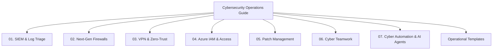

# 🛡️ Cybersecurity Best Practices & Operations Guide

> **A Comprehensive Reference Guide for First-Year Cybersecurity Specialists & SOC Analysts**  
> Focus Areas: **SIEM & Logging**, **Next-Gen Firewalls**, **VPN & Zero-Trust Access**, **Azure IAM**, **Patch Management**, **Incident Teamwork**, and **AI & Cyber Automation**.

---

## 📌 About This Repository

This repository serves as a practical, field-tested reference manual and portfolio covering key pillars of enterprise cybersecurity operations. It is designed to bridge the gap between theoretical knowledge and real-world SOC/Infosec workflows.

---

## 🗺️ Repository Structure & Quick Links

| Domain | Description | Key Topics | Quick Link |
| :--- | :--- | :--- | :--- |
| **01. SIEM & Logging** | Log aggregation, alert correlation, and SOC triage workflows. | Event IDs, Detection Rules, Triage Framework | [View Module](01-siem/README.md) |
| **02. Firewalls** | Network defense, rule hierarchy, and zone isolation. | Stateful/NGFW, Rule Auditing, Egress Rules | [View Module](02-firewalls/README.md) |
| **03. VPN Security** | Remote access security, tunneling, and Zero Trust transition. | Split-Tunneling, MFA, Host Checks, ZTNA | [View Module](03-vpn-security/README.md) |
| **04. Azure IAM** | Identity management, RBAC, and access control in Microsoft Entra ID. | PoLP, Conditional Access, PIM, FIDO2 | [View Module](04-azure-iam/README.md) |
| **05. Patch Management** | Vulnerability prioritization, SLA enforcement, and ring deployments. | CVSS/EPSS, Testing Rings, Rollback Plan | [View Module](05-patch-management/README.md) |
| **06. Cyber Teamwork** | Cross-functional SOC communication, shift handovers, and IR. | Incident Tickets, Shift Handovers, Post-Mortems | [View Module](06-cyber-teamwork/README.md) |
| **07. Cyber Automation** | Autonomous AI agents, threat monitoring, containment & auto-reporting. | Multi-Agent SOC, EDR Blocking, MITRE ATT&CK, Auto Incident Reports | [View Module](07-cybersecurity-automation/README.md) |

---

## 🛠️ Included Operational Templates

Located in the [`/templates`](templates/) directory:
* [`shift-handover-template.md`](templates/shift-handover-template.md) - Standardized SOC Analyst Shift Changeover Log.
* [`firewall-rule-request.md`](templates/firewall-rule-request.md) - Change Management Request Form for Firewall Policy Changes.

---

## 🚀 Key Takeaways for 1st-Year Cyber Professionals

1. **Log Everything That Matters**: A SIEM is only as good as the event telemetry fed into it. Focus on Windows Security Log IDs `4624`, `4625`, `4672`, and `4720`.
2. **Default Deny Always**: Firewalls must enforce explicit deny rules at the bottom of every policy stack.
3. **Identity is the New Perimeter**: Traditional VPNs provide network access; Azure Conditional Access ensures continuous verification (Zero Trust).
4. **Patch by Exposure, Not Just CVSS**: Prioritize vulnerabilities actively targeted in the wild (EPSS score + active exploitation).
5. **Clear Communication Saves Time**: In incident response, structured handovers prevent dropped alerts and critical miscommunications.

---

## 📄 License & Usage

This project is open for study, reference, and customization for personal portfolios and SOC training documentation.
